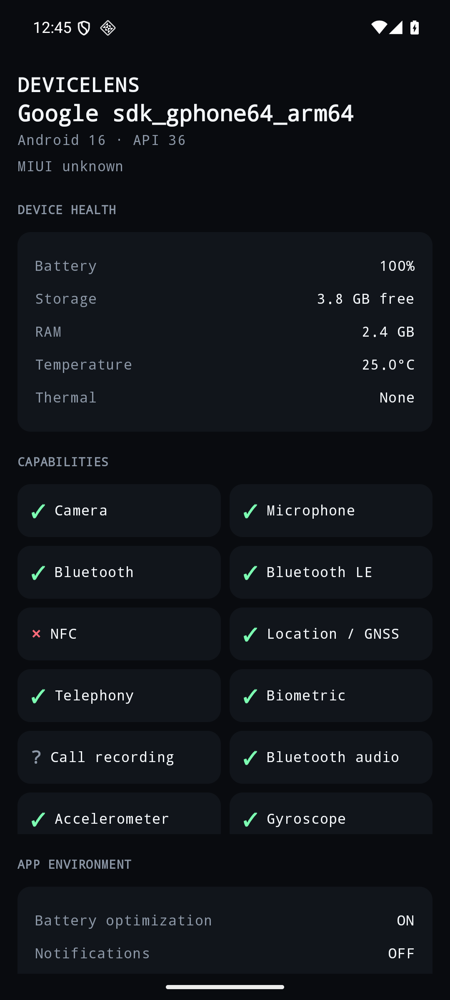

# DeviceLens

Privacy-first Android diagnostic scanner. Performs a fast local scan and turns platform information into a readable, exportable health + capability report. No account, no backend, no cloud.

> “Know exactly what your Android device can do, what state it is in, and what your apps are allowed to access.”


## Stack

- Kotlin 2.0.21, AGP 8.7.3, compileSdk 36, minSdk 26, Java 17
- Jetpack Compose + Material 3 (custom "Instrument Panel" tokens)
- Coroutines, ViewModel, Navigation-Compose
- `PdfDocument` for PDF export, `org.json` for JSON export

## Project layout

```
app/src/main/java/com/devicelens/app/
  MainActivity.kt
  ui/{scan,dashboard,detail,report,theme}
  domain/{model/DeviceReport.kt,usecase/RunDeviceScanUseCase.kt}
  data/{collectors/*,report/{Pdf,Json}ReportGenerator.kt}
  util/ShareHelper.kt
```

## Build & test

```bash
./gradlew :app:assembleDebug
./gradlew :app:testDebugUnitTest
./gradlew :app:assembleRelease
```

Requires Android SDK with platform `android-36` + build-tools `36.0.0`.




## Demo (45–60s)

1. Open DeviceLens, let the real scan complete
2. Show model + Android version
3. Point to battery / RAM / storage / temperature
4. Open capability grid, show one available + one restricted
5. Generate Device Report → preview → share PDF

## Privacy

Offline-first. No analytics in MVP. Scan failures degrade gracefully to `Unknown` / `Not exposed` rather than fake values.
